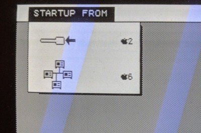

# Inferred schematics for the AppleNet network adaptor for Lisa

AppleNet was a networking infrastructure made by Apple in the early 1980s.
It was never put into production. More information:

* http://bitsavers.informatik.uni-stuttgart.de/pdf/apple/lisa/appleNet/
* https://en.wikipedia.org/wiki/AppleTalk#AppleNet
* https://books.google.com/books?id=-C8EAAAAMBAJ&lpg=PA14&ots=XqaEJnNOLj&pg=PA14

After buying an AppleNet adaptor card that fits into the expansion port of
an Apple Lisa, I attempted to derive a schematic by "beeping out" the circuit
board: that is, finding connections between all of the components with a
multimeter. This repository contains the result.

## Disclaimers

This is the most complicated schematic I have ever made, and I don't think I
did a very nice job. There is an art to laying out a schematic that's easy to
follow, and I have not mastered it.

Additionally, I'm a computer scientist, not an EE. There is much I don't
understand about electronics or schematic diagrams---I'm more likely to make
omissions or errors than a trained professional, and I probably didn't use some
conventions that most schematics follow.

Expect mistakes.

(But I do know what bypass capacitors are.)

## Other notes

This schematic is released into the public domain. Nobody owns it.

-- _[Tom Stepleton](mailto:stepleton@gmail.com), 25 November 2018, Jersey City_
